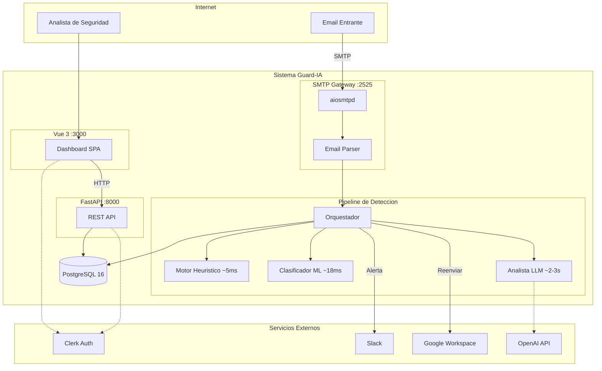
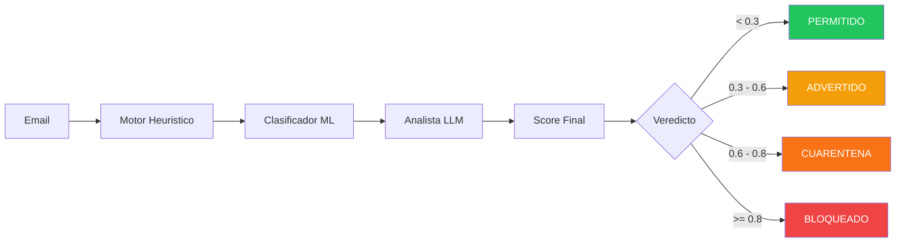
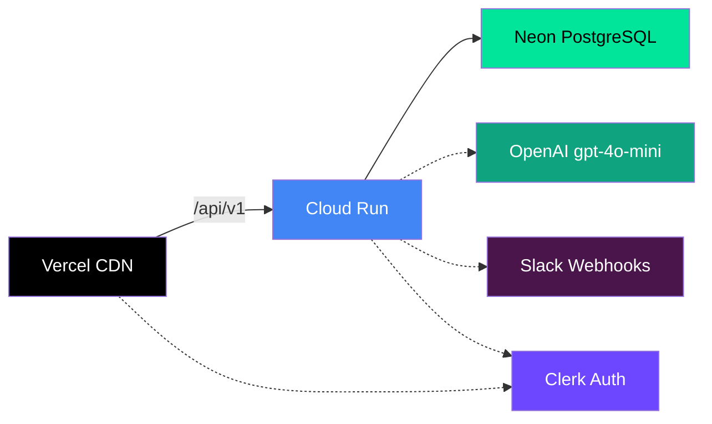
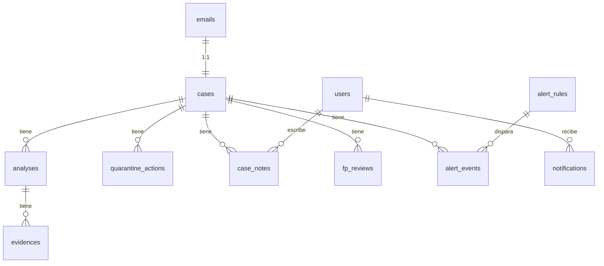
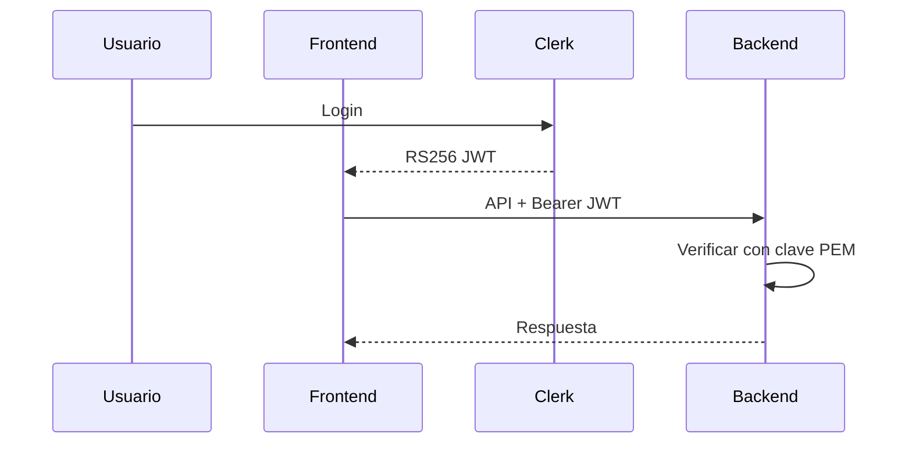

<p align="center">
  
</p>

<h1 align="center">Guard-IA</h1>

<p align="center">
  <strong>Middleware de deteccion de fraude en emails potenciado por IA</strong><br/>
  Deteccion de phishing, BEC e impersonacion para Google Workspace
</p>

<p align="center">
  <a href="README.md">English</a> &middot;
  <a href="#arquitectura">Arquitectura</a> &middot;
  <a href="#pipeline-de-deteccion">Pipeline</a> &middot;
  <a href="#stack-tecnologico">Tech Stack</a> &middot;
  <a href="#inicio-rapido">Inicio Rapido</a> &middot;
  <a href="docs/ARCHITECTURE.md">Documentacion Completa</a>
</p>

---

## Descripcion General

Guard-IA es un **sistema de seguridad de email pre-entrega** que intercepta emails entrantes a traves de un gateway SMTP antes de que lleguen a las casillas de Google Workspace. Cada email es analizado por un **pipeline de 3 capas de IA** que combina heuristicas deterministas, un modelo ML fine-tuned, y un analista LLM para producir un score de amenaza unificado y un veredicto accionable.

Desarrollado como proyecto de tesis universitaria (ORT Uruguay) para [Strike Security](https://strike.sh).

### Caracteristicas Principales

- **Intercepcion pre-entrega** -- analiza emails antes de llegar a la bandeja, no despues
- **Defensa en profundidad de 3 capas** -- heuristicas, ML y LLM trabajando juntos
- **Pipeline sub-5 segundos** -- analisis en tiempo real sin retrasos en la entrega
- **Diseno fail-open** -- si el pipeline falla, el email se entrega para no bloquear correo legitimo
- **Dashboard de analista** -- gestion de casos en tiempo real, revision de cuarentena y analiticas de amenazas
- **Alertas por Slack** -- notificaciones instantaneas para detecciones de alto riesgo
- **Degradacion graceful** -- el pipeline ajusta pesos automaticamente cuando capas no estan disponibles

---

## Arquitectura



> Para documentacion completa de arquitectura con diagramas ER, flujos de autenticacion y topologia de deployment, ver [`docs/ARCHITECTURE.md`](docs/ARCHITECTURE.md).

---

## Pipeline de Deteccion

Cada email entrante pasa por tres capas de analisis secuenciales:



| Capa | Tiempo | Peso | Descripcion |
|------|--------|------|-------------|
| **Motor Heuristico** | ~5ms | 30% | Analisis basado en reglas: autenticacion SPF/DKIM/DMARC, typosquatting de dominios, reputacion de URLs, patrones de keywords. 4 sub-motores con bonificaciones por correlacion. |
| **Clasificador ML** | ~18ms | 50% | Clasificador binario DistilBERT fine-tuned (66M params). Input: asunto + cuerpo. Output: probabilidad de phishing. |
| **Analista LLM** | ~2-3s | 20% | Evaluacion de riesgo independiente via OpenAI GPT. Retorna score + explicacion en lenguaje natural. |

**Score Final** = `0.30 x Heuristico + 0.50 x ML + 0.20 x LLM`

Cuando alguna capa no esta disponible, los pesos se redistribuyen automaticamente (ej: Heuristico + ML = 40% + 60%).

| Veredicto | Score | Accion |
|-----------|-------|--------|
| **Permitido** | < 0.3 | Reenviar a Gmail |
| **Advertido** | 0.3 - 0.6 | Entregar + alertar al analista |
| **Cuarentena** | 0.6 - 0.8 | Retener para revision manual |
| **Bloqueado** | >= 0.8 | Rechazar a nivel SMTP (550) |

---

## Stack Tecnologico

### Backend

| | Tecnologia |
|---|---|
| **Lenguaje** | Python 3.11 |
| **Framework** | FastAPI (async) |
| **ORM** | SQLAlchemy 2.0 async + asyncpg |
| **Base de datos** | PostgreSQL 16 (Neon serverless) |
| **Validacion** | Pydantic v2 |
| **SMTP** | aiosmtpd |
| **Logging** | structlog (JSON) |
| **LLM** | OpenAI GPT (httpx) |
| **Linting** | ruff, mypy |
| **Tests** | pytest + pytest-asyncio |

### Frontend

| | Tecnologia |
|---|---|
| **Framework** | Vue 3 (Composition API, `<script setup>`) |
| **Lenguaje** | TypeScript |
| **Build** | Vite |
| **Estado** | Pinia |
| **HTTP** | Axios |
| **Graficos** | Chart.js via vue-chartjs |
| **Auth** | Clerk Vue SDK |
| **Iconos** | Material Symbols Rounded |

### ML

| | Tecnologia |
|---|---|
| **Modelo** | DistilBERT (distilbert-base-uncased) fine-tuned |
| **Parametros** | 66M |
| **Inferencia** | ~18ms |
| **Tracking** | MLflow |

### Infraestructura

| Servicio | Proposito |
|----------|-----------|
| **Google Cloud Run** | Hosting del backend (contenedor) |
| **Vercel** | Hosting del frontend (CDN + SPA) |
| **Neon** | PostgreSQL serverless |
| **Clerk** | Autenticacion (RS256 JWT, solo por invitacion) |
| **Slack API** | Webhooks de alertas |
| **Google Workspace** | Destino del relay de email |

---

## Estructura del Proyecto

```
guardia/
├── backend/                 # Python 3.11 / FastAPI
│   ├── app/
│   │   ├── api/v1/          # Endpoints REST (12 modulos)
│   │   ├── core/            # Constantes, seguridad, excepciones
│   │   ├── db/              # Sesion SQLAlchemy + migraciones Alembic
│   │   ├── gateway/         # Servidor SMTP, parser, relay
│   │   ├── models/          # Modelos ORM (16 tablas)
│   │   ├── schemas/         # Request/response Pydantic v2
│   │   └── services/        # Logica de negocio + pipeline
│   ├── scripts/             # Simulacion de emails y seeding
│   └── Dockerfile
├── frontend/                # Vue 3 / TypeScript / Vite
│   ├── src/
│   │   ├── views/           # 7 componentes de pagina
│   │   ├── components/      # UI reutilizable (6 categorias)
│   │   ├── stores/          # 7 Pinia stores
│   │   ├── services/        # Clientes API (Axios)
│   │   └── types/           # Interfaces TypeScript
│   └── Dockerfile
├── ml/                      # Fine-tuning e inferencia DistilBERT
│   ├── src/                 # Pipeline de entrenamiento
│   ├── data/                # Datasets (raw/processed/splits)
│   ├── models/              # Pesos del modelo guardados
│   └── notebooks/           # Experimentos Jupyter
├── docs/
│   └── ARCHITECTURE.md      # Documentacion completa de arquitectura
├── docker-compose.yml
├── Makefile
└── .env.example
```

---

## Inicio Rapido

### Requisitos

- Python 3.11+
- Node.js 18+
- PostgreSQL 16 (o cuenta Neon)
- Docker & Docker Compose (opcional)

### 1. Clonar y configurar

```bash
git clone https://github.com/your-org/guardia.git
cd guardia
cp .env.example .env.local
# Editar .env.local con tu URL de base de datos, API keys, etc.
```

### 2. Setup del backend

```bash
cd backend
python -m venv .venv
source .venv/bin/activate
pip install -r requirements.txt
alembic upgrade head
uvicorn app.main:app --reload --port 8000
```

### 3. Setup del frontend

```bash
cd frontend
npm install
npm run dev
```

### 4. Usando Make (recomendado)

```bash
make dev              # Iniciar todos los servicios (db, mlflow, backend, frontend)
make test             # Ejecutar todos los tests
make lint             # ruff + mypy + eslint
make migrate          # Ejecutar migraciones Alembic
make migration msg="" # Crear nueva migracion
```

### 5. Cargar datos de prueba

```bash
cd backend
python -m scripts.seed_test_emails
```

---

## Deployment

### Ambientes

| Ambiente | Backend | Frontend | Base de datos | LLM |
|----------|---------|----------|---------------|-----|
| **Local** | localhost:8000 | localhost:3000 | Neon (compartida) | gpt-4o-mini |
| **Staging** | Cloud Run (us-east1) | Vercel | Neon (compartida) | gpt-4o-mini |
| **Produccion** | Cloud Run | Vercel | Neon (dedicada) | OpenAI GPT |

### Configuracion

Los archivos de entorno se cargan segun `APP_ENV`:

```
.env.local       → desarrollo
.env.staging     → testing en la nube
.env.production  → produccion
```

### Staging



---

## Resumen de API

URL base: `/api/v1`

| Metodo | Endpoint | Descripcion |
|--------|----------|-------------|
| `POST` | `/emails/ingest` | Ingestar nuevo email |
| `GET` | `/cases` | Listar casos (paginado, filtrado) |
| `GET` | `/cases/:id` | Detalle del caso con analisis completo |
| `POST` | `/cases/:id/resolve` | Resolver caso (permitir/bloquear) |
| `GET` | `/dashboard/stats` | Analiticas del dashboard |
| `GET` | `/quarantine` | Listar emails en cuarentena |
| `POST` | `/quarantine/:id/release` | Liberar de cuarentena |
| `GET` | `/health` | Health check |

Todos los endpoints (excepto `/health`) requieren un token JWT Bearer de Clerk.

---

## Base de Datos

16 tablas PostgreSQL gestionadas via SQLAlchemy 2.0 + migraciones Alembic.



Tablas principales: `emails`, `cases`, `analyses`, `evidences`, `users`, `quarantine_actions`, `fp_reviews`, `case_notes`, `alert_rules`, `alert_events`, `notifications`, `policy_entries`, `custom_rules`, `settings`.

---

## Autenticacion

- **Proveedor:** [Clerk](https://clerk.com) (autenticacion gestionada)
- **Metodo:** RS256 JWT (asimetrico)
- **Acceso:** Solo por invitacion (sin registro publico)
- **Roles:** `administrator`, `analyst`, `auditor`
- **Sincronizacion:** Hibrida -- Clerk gestiona auth, el backend mantiene registros de usuario locales



---

## Desarrollo

### Puertos locales

| Servicio | Puerto |
|----------|--------|
| Frontend (Vite) | 3000 |
| Backend (FastAPI) | 8000 |
| SMTP Gateway | 2525 |
| PostgreSQL | 5432 |
| MLflow | 5000 |

### Comandos

```bash
make dev              # Iniciar todos los servicios
make test             # Ejecutar tests
make lint             # Lint (ruff + mypy + eslint)
make migrate          # Aplicar migraciones
make migration msg="" # Generar nueva migracion
```

### Estilo de codigo

- **Python:** Indent 4 espacios, 100 chars por linea, ruff + mypy
- **TypeScript/Vue:** Indent 2 espacios, `<script setup lang="ts">`
- **General:** Finales LF, UTF-8, newline final, imports arriba

---

## Contexto Academico

Este proyecto es una tesis universitaria (ORT Uruguay) desarrollada para Strike Security. Las decisiones tecnicas balancean viabilidad productiva con rigor academico, incluyendo trade-offs arquitecturales documentados y metricas de performance de deteccion medibles.

---

## Licencia

Todos los derechos reservados. Strike Security.

---

<p align="center">
  <sub>Construido con Python, Vue e IA para Strike Security</sub>
</p>
