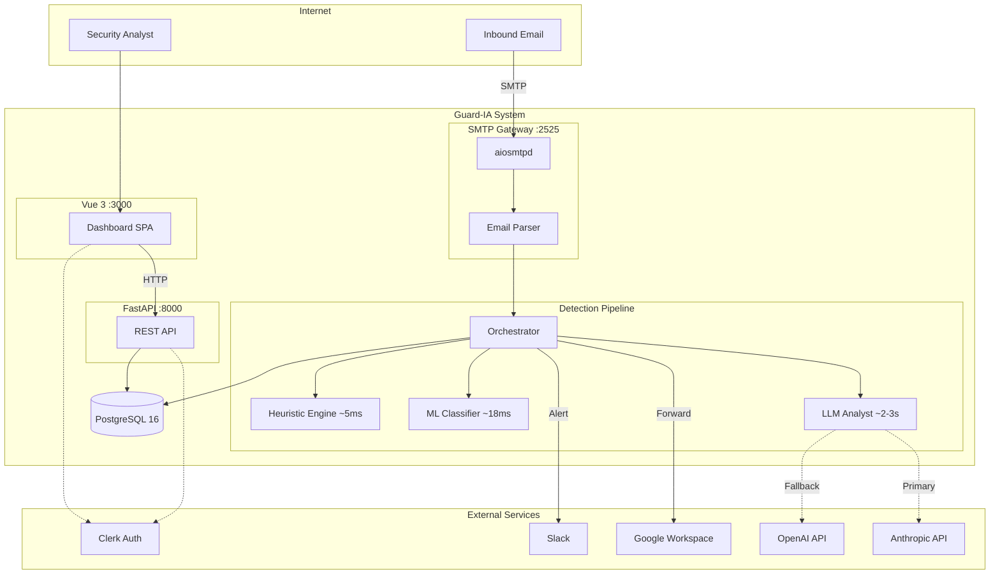
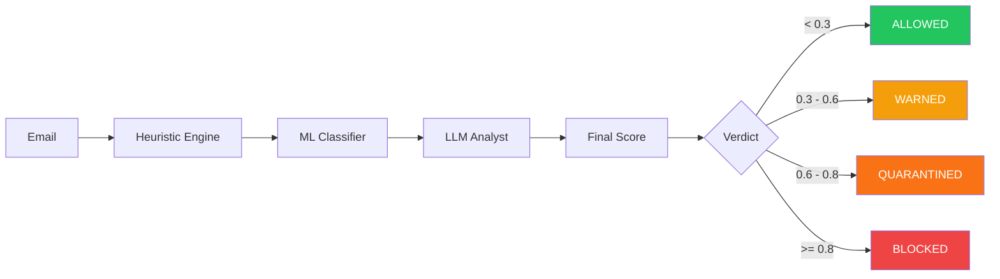
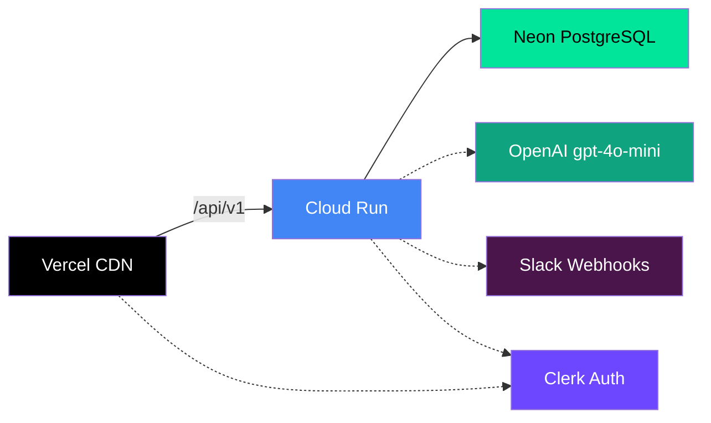
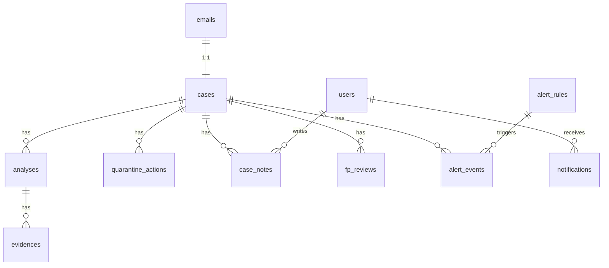
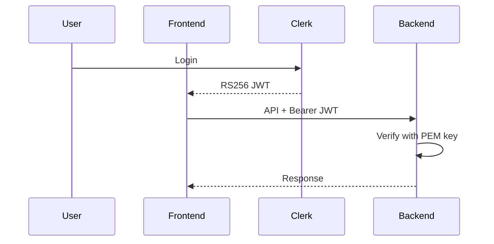

<p align="center">
  
</p>

<h1 align="center">Guard-IA</h1>

<p align="center">
  <strong>AI-powered pre-delivery email fraud detection middleware</strong><br/>
  Phishing, BEC & impersonation detection for Google Workspace
</p>

<p align="center">
  <a href="README.es.md">Español</a> &middot;
  <a href="#architecture">Architecture</a> &middot;
  <a href="#detection-pipeline">Pipeline</a> &middot;
  <a href="#tech-stack">Tech Stack</a> &middot;
  <a href="#getting-started">Getting Started</a> &middot;
  <a href="#deployment">Deployment</a> &middot;
  <a href="docs/ARCHITECTURE.md">Full Documentation</a>
</p>

---

## Overview

Guard-IA is a **pre-delivery email security system** that intercepts inbound emails via an SMTP gateway before they reach Google Workspace inboxes. Every email is analyzed through a **3-layer AI pipeline** that combines deterministic heuristics, a fine-tuned ML model, and an LLM-based risk analyst to produce a unified threat score and actionable verdict.

Built as a university thesis project (ORT Uruguay) for [Strike Security](https://strike.sh).

### Key Features

- **Pre-delivery interception** -- analyzes emails before inbox delivery, not after
- **3-layer defense-in-depth** -- heuristics, ML and LLM working together
- **Sub-5-second pipeline** -- real-time analysis without delivery delays
- **Fail-open design** -- pipeline failures forward email to avoid blocking legitimate mail
- **Analyst dashboard** -- real-time case management, quarantine review and threat analytics
- **Slack alerts** -- instant notifications for high-risk detections
- **Graceful degradation** -- pipeline adjusts weights automatically when layers are unavailable

---

## Architecture



> For full architecture documentation with ER diagrams, auth flows and deployment topology, see [`docs/ARCHITECTURE.md`](docs/ARCHITECTURE.md).

---

## Detection Pipeline

Every inbound email passes through three sequential analysis layers:



| Layer | Time | Weight | Description |
|-------|------|--------|-------------|
| **Heuristic Engine** | ~5ms | 30% | Rule-based analysis: SPF/DKIM/DMARC authentication, domain typosquatting, URL reputation, keyword patterns. 4 sub-engines with correlation bonuses. |
| **ML Classifier** | ~18ms | 50% | DistilBERT fine-tuned (66M params) binary classifier. Input: subject + body. Output: phishing probability. |
| **LLM Analyst** | ~2-3s | 20% | Independent AI risk assessment via Claude (primary) or GPT-4o-mini (fallback). Returns score + human-readable explanation. |

**Final Score** = `0.30 x Heuristic + 0.50 x ML + 0.20 x LLM`

When layers are unavailable, weights redistribute automatically (e.g., Heuristic + ML only = 40% + 60%).

| Verdict | Score | Action |
|---------|-------|--------|
| **Allowed** | < 0.3 | Forward to Gmail |
| **Warned** | 0.3 - 0.6 | Deliver + alert analyst |
| **Quarantined** | 0.6 - 0.8 | Hold for manual review |
| **Blocked** | >= 0.8 | Reject at SMTP level (550) |

---

## Tech Stack

### Backend

| | Technology |
|---|---|
| **Language** | Python 3.11 |
| **Framework** | FastAPI (async) |
| **ORM** | SQLAlchemy 2.0 async + asyncpg |
| **Database** | PostgreSQL 16 (Neon serverless) |
| **Validation** | Pydantic v2 |
| **SMTP** | aiosmtpd |
| **Logging** | structlog (JSON) |
| **LLM** | Anthropic Claude + OpenAI GPT (httpx) |
| **Linting** | ruff, mypy |
| **Tests** | pytest + pytest-asyncio |

### Frontend

| | Technology |
|---|---|
| **Framework** | Vue 3 (Composition API, `<script setup>`) |
| **Language** | TypeScript |
| **Build** | Vite |
| **State** | Pinia |
| **HTTP** | Axios |
| **Charts** | Chart.js via vue-chartjs |
| **Auth** | Clerk Vue SDK |
| **Icons** | Material Symbols Rounded |

### ML

| | Technology |
|---|---|
| **Model** | DistilBERT (distilbert-base-uncased) fine-tuned |
| **Parameters** | 66M |
| **Inference** | ~18ms |
| **Tracking** | MLflow |

### Infrastructure

| Service | Purpose |
|---------|---------|
| **Google Cloud Run** | Backend container hosting |
| **Vercel** | Frontend CDN + SPA hosting |
| **Neon** | Serverless PostgreSQL |
| **Clerk** | Authentication (RS256 JWT, invitation-only) |
| **Slack API** | Alert webhooks |
| **Google Workspace** | Email relay target |

---

## Project Structure

```
guardia/
├── backend/                 # Python 3.11 / FastAPI
│   ├── app/
│   │   ├── api/v1/          # REST endpoints (12 modules)
│   │   ├── core/            # Constants, security, exceptions
│   │   ├── db/              # SQLAlchemy session + Alembic migrations
│   │   ├── gateway/         # SMTP server, email parser, relay
│   │   ├── models/          # ORM models (16 tables)
│   │   ├── schemas/         # Pydantic v2 request/response
│   │   └── services/        # Business logic + detection pipeline
│   ├── scripts/             # Email simulation & DB seeding
│   └── Dockerfile
├── frontend/                # Vue 3 / TypeScript / Vite
│   ├── src/
│   │   ├── views/           # 7 page components
│   │   ├── components/      # Reusable UI (6 categories)
│   │   ├── stores/          # 7 Pinia stores
│   │   ├── services/        # API clients (Axios)
│   │   └── types/           # TypeScript interfaces
│   └── Dockerfile
├── ml/                      # DistilBERT fine-tuning & inference
│   ├── src/                 # Training pipeline
│   ├── data/                # Datasets (raw/processed/splits)
│   ├── models/              # Saved model weights
│   └── notebooks/           # Jupyter experiments
├── docs/
│   └── ARCHITECTURE.md      # Full architecture documentation
├── docker-compose.yml
├── Makefile
└── .env.example
```

---

## Getting Started

### Prerequisites

- Python 3.11+
- Node.js 18+
- PostgreSQL 16 (or Neon account)
- Docker & Docker Compose (optional)

### 1. Clone & configure

```bash
git clone https://github.com/your-org/guardia.git
cd guardia
cp .env.example .env.local
# Edit .env.local with your database URL, API keys, etc.
```

### 2. Backend setup

```bash
cd backend
python -m venv .venv
source .venv/bin/activate
pip install -r requirements.txt
alembic upgrade head
uvicorn app.main:app --reload --port 8000
```

### 3. Frontend setup

```bash
cd frontend
npm install
npm run dev
```

### 4. Using Make (recommended)

```bash
make dev              # Start all services (db, mlflow, backend, frontend)
make test             # Run all tests
make lint             # ruff + mypy + eslint
make migrate          # Run Alembic migrations
make migration msg="" # Create new migration
```

### 5. Seed test data

```bash
cd backend
python -m scripts.seed_test_emails
```

---

## Deployment

### Environments

| Environment | Backend | Frontend | Database | LLM |
|------------|---------|----------|----------|-----|
| **Local** | localhost:8000 | localhost:3000 | Neon (shared) | gpt-4o-mini |
| **Staging** | Cloud Run (us-east1) | Vercel | Neon (shared) | gpt-4o-mini |
| **Production** | Cloud Run | Vercel | Neon (dedicated) | Claude + GPT fallback |

### Configuration

Environment files are loaded based on `APP_ENV`:

```
.env.local       → development
.env.staging     → cloud testing
.env.production  → production
```

### Staging



---

## API Overview

Base URL: `/api/v1`

| Method | Endpoint | Description |
|--------|----------|-------------|
| `POST` | `/emails/ingest` | Ingest new email |
| `GET` | `/cases` | List cases (paginated, filtered) |
| `GET` | `/cases/:id` | Case detail with full analysis |
| `POST` | `/cases/:id/resolve` | Resolve case (allow/block) |
| `GET` | `/dashboard/stats` | Dashboard analytics |
| `GET` | `/quarantine` | List quarantined emails |
| `POST` | `/quarantine/:id/release` | Release from quarantine |
| `GET` | `/health` | Health check |

All endpoints (except `/health`) require a Clerk JWT Bearer token.

---

## Database

16 PostgreSQL tables managed via SQLAlchemy 2.0 + Alembic migrations.



Core tables: `emails`, `cases`, `analyses`, `evidences`, `users`, `quarantine_actions`, `fp_reviews`, `case_notes`, `alert_rules`, `alert_events`, `notifications`, `policy_entries`, `custom_rules`, `settings`.

---

## Authentication

- **Provider:** [Clerk](https://clerk.com) (managed authentication)
- **Method:** RS256 JWT (asymmetric)
- **Access:** Invitation-only (no public signup)
- **Roles:** `administrator`, `analyst`, `auditor`
- **Sync:** Hybrid -- Clerk manages auth, backend maintains local user records



---

## Development

### Local ports

| Service | Port |
|---------|------|
| Frontend (Vite) | 3000 |
| Backend (FastAPI) | 8000 |
| SMTP Gateway | 2525 |
| PostgreSQL | 5432 |
| MLflow | 5000 |

### Commands

```bash
make dev              # Start all services
make test             # Run test suite
make lint             # Lint (ruff + mypy + eslint)
make migrate          # Apply migrations
make migration msg="" # Generate new migration
```

### Code style

- **Python:** 4-space indent, 100 char lines, ruff + mypy
- **TypeScript/Vue:** 2-space indent, `<script setup lang="ts">`
- **General:** LF endings, UTF-8, trailing newline, imports at top

---

## Academic Context

This project is a university thesis (ORT Uruguay) developed for Strike Security. Technical decisions balance production viability with academic rigor, including documented architectural trade-offs and measurable detection performance metrics.

---

## License

All rights reserved. Strike Security.

---

<p align="center">
  <sub>Built with Python, Vue, and AI for Strike Security</sub>
</p>
