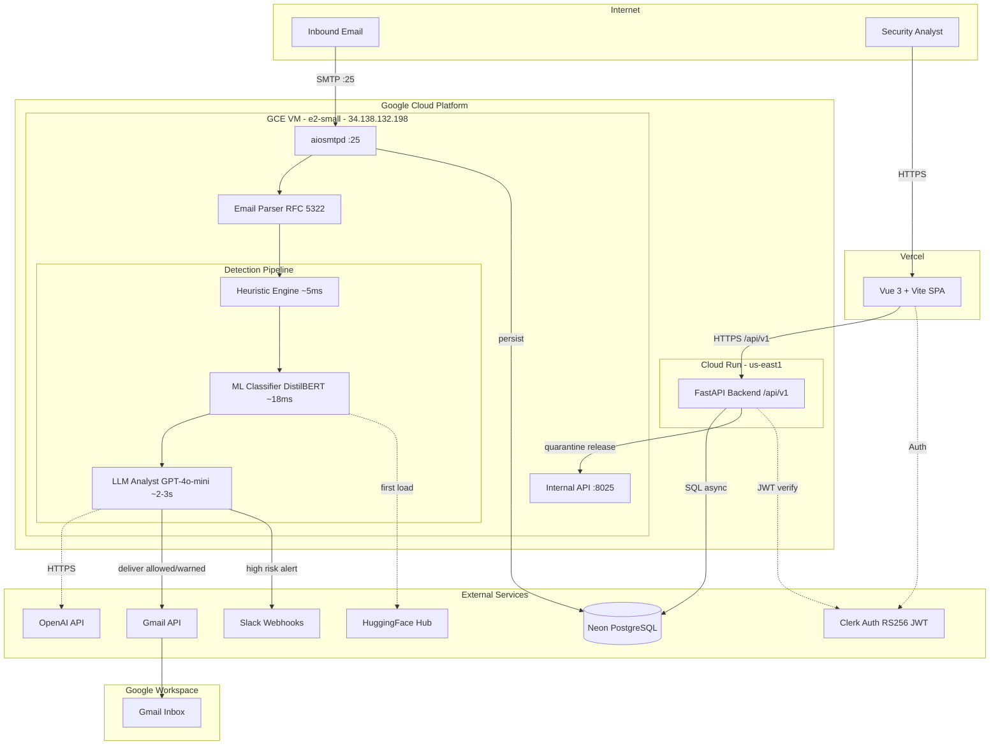
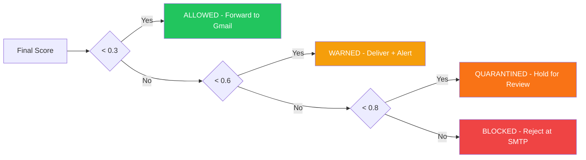
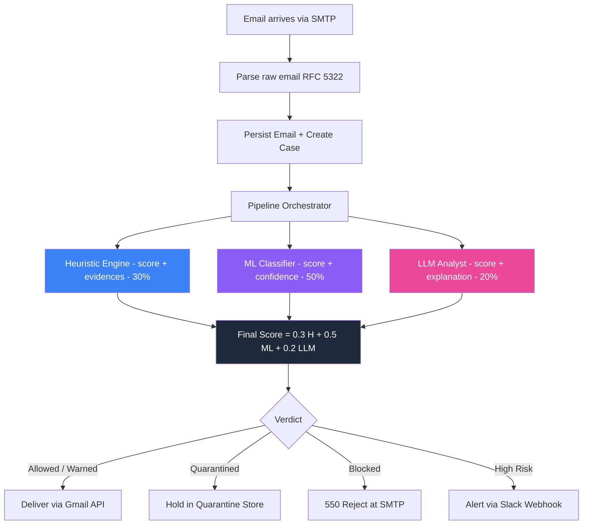
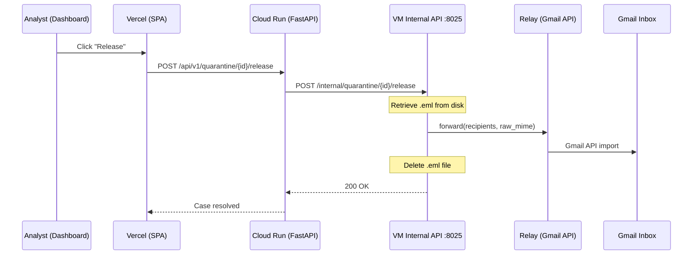
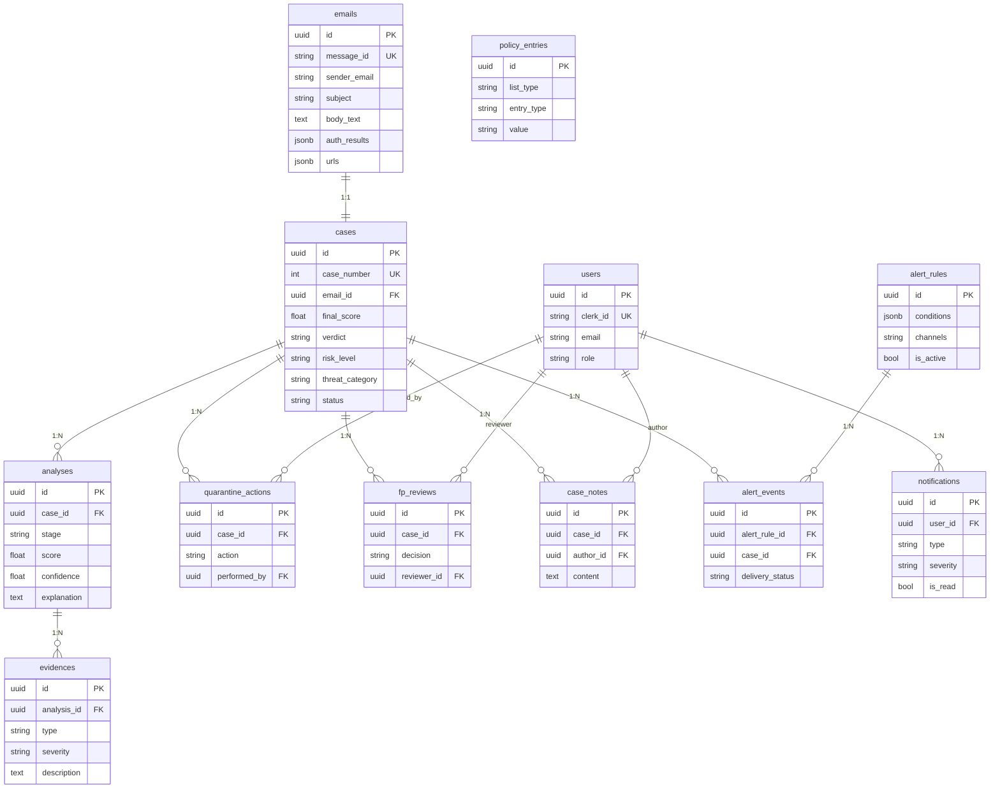
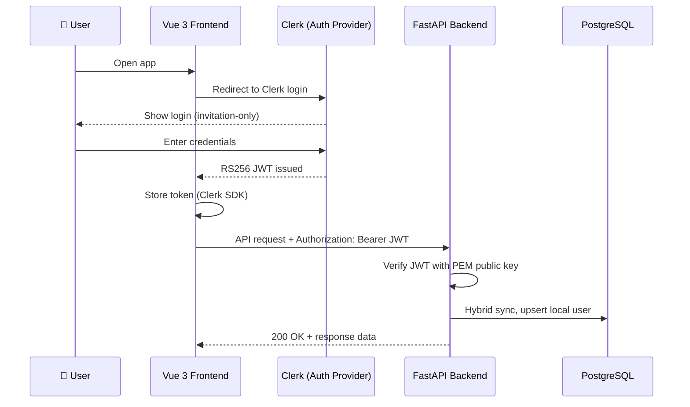
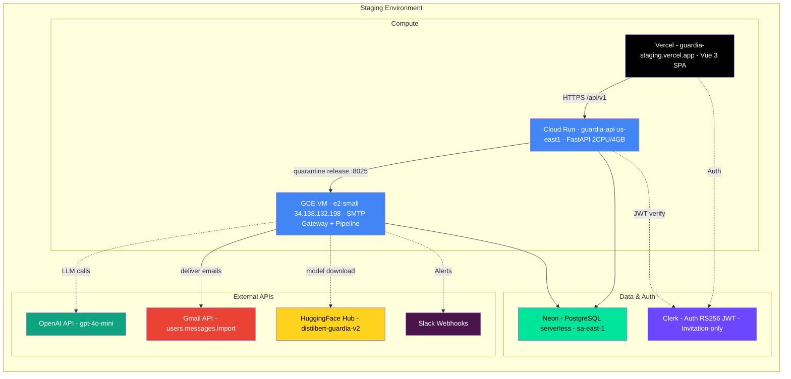
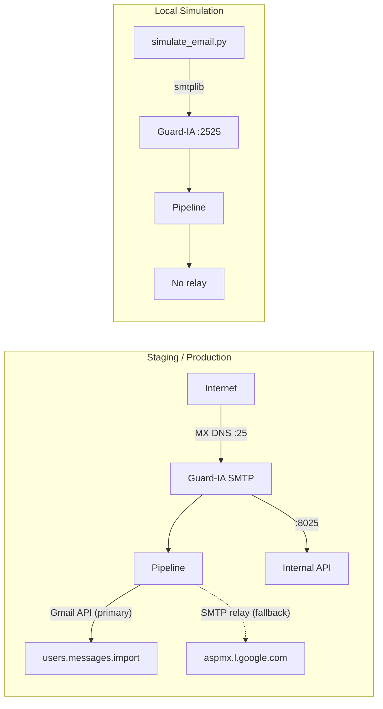

# Guard-IA — Architecture Documentation

> AI-powered pre-delivery email fraud detection middleware (phishing, BEC, impersonation).
> University thesis (ORT Uruguay) for Strike Security.

---

## Table of Contents

1. [System Overview](#1-system-overview)
2. [Architecture Diagram](#2-architecture-diagram)
3. [Detection Pipeline](#3-detection-pipeline)
4. [Backend Architecture](#4-backend-architecture)
5. [Frontend Architecture](#5-frontend-architecture)
6. [ML Module](#6-ml-module)
7. [Database Design](#7-database-design)
8. [Authentication & Security](#8-authentication--security)
9. [Deployment & Environments](#9-deployment--environments)
10. [Infrastructure & Services](#10-infrastructure--services)
11. [Project Structure](#11-project-structure)
12. [Configuration Reference](#12-configuration-reference)

---

## 1. System Overview

Guard-IA is a **pre-delivery email fraud detection system** that intercepts emails before they reach the user's inbox. It operates as an SMTP gateway between the internet and Google Workspace, analyzing every inbound email through a 3-layer AI pipeline.

**Key characteristics:**
- **Single-tenant**: Strike Security only
- **Pre-delivery**: Intercepts before Gmail delivery (not post-delivery scanning)
- **3-layer pipeline**: Heuristics + ML + LLM for defense-in-depth
- **Real-time**: Sub-5-second total pipeline execution
- **Fail-open**: If the pipeline crashes, emails are forwarded to avoid blocking legitimate mail

---

## 2. Architecture Diagram



### Verdict Decision



### Data Flow



---

## 3. Detection Pipeline

### 3.1 Layer 1: Heuristic Engine (~5ms)

Deterministic, rule-based analysis that examines email metadata for known threat patterns.

**Sub-engines (weight distribution, sum = 1.0):**

| Sub-engine | Weight | Signals |
|-----------|--------|---------|
| **Authentication** | 35% | SPF fail/softfail, DKIM fail, DMARC fail, compound failures, contextual domain multipliers |
| **Domain** | 25% | Typosquatting, brand lookalike detection, blacklisted domains, suspicious TLDs |
| **URL** | 25% | URL shorteners, IP-based URLs, domain mismatches |
| **Keywords** | 15% | Urgency language, phishing terms, excessive capitalization |

**Correlation bonuses:**
- 3 sub-engines fired: +15% boost
- All 4 sub-engines fired: +25% boost
- All 3 auth mechanisms failed: +30% bonus to auth score

**Brand lookalike detection (v0.2):**
- Detects character substitution attacks (e.g., `str1ke-security.com` targeting `strike-security.com`)
- Generates brand variants via common substitutions: i→1/l/!, e→3, a→@/4, o→0, s→5/$, t→7
- Checks brand+suffix combinations (-security, -tech, -support, etc.)
- Protected domains sourced from `ACCEPTED_DOMAINS` + allowlist
- Match triggers `DOMAIN_LOOKALIKE` evidence (score: 0.8)

**Auth contextual modifiers (v0.2):**
- Auth failures from brand lookalike domains: score multiplied by 1.5x
- Auth failures from known brand domains: score multiplied by 1.3x

**Output:** Score (0.0-1.0), list of `Evidence` items with type, severity, description.

### 3.2 Layer 2: ML Classifier (~18ms)

DistilBERT fine-tuned binary classifier (66M parameters).

- **Input:** Email subject + body text concatenated
- **Output:** Phishing probability (0.0-1.0) + confidence score
- **Training:** Fine-tuned on phishing/legitimate email corpus
- **Fallback:** When the model is unavailable, pipeline operates in heuristic-only mode with adjusted weights

### 3.3 Layer 3: LLM Analyst (~2-3s)

Independent AI risk assessment providing a score and human-readable explanation.

- **Provider:** OpenAI GPT
- **Output:** JSON `{"score": 0.85, "explanation": "..."}`
- **Scoring guidelines:**
  - 0.0-0.2: Clearly legitimate
  - 0.2-0.4: Minor suspicious signals
  - 0.4-0.6: Moderately suspicious
  - 0.6-0.8: Highly suspicious
  - 0.8-1.0: Almost certainly phishing/BEC

The LLM sees all evidence from prior stages and provides an **independent third opinion**. It may agree or disagree with the heuristic and ML scores.

**Calibration (v0.2):** The system prompt includes a score differentiation guide and 6 calibration examples ranging from clearly legitimate (0.05) to almost certainly phishing (0.92). Scores above 0.85 are reserved for cases with authentication failures + domain impersonation + social engineering + malicious URLs/attachments all present.

### 3.4 Final Score Calculation

The final score is a weighted average with graceful degradation and post-processing adjustments:

| Stages Available | Weights |
|-----------------|---------|
| All 3 (Heuristic + ML + LLM) | 30% + 50% + 20% |
| Heuristic + ML only | 40% + 60% |
| Heuristic + LLM only | 60% + 40% |
| Heuristic only | 100% |

**Post-ML guardrail (v0.2):** When heuristics detect a domain attack (lookalike or typosquatting) but ML scores < 0.3 (because ML only sees text, not domain metadata), the ML score is floored to 0.3 to prevent domain-based attacks from slipping through.

**LLM floor/cap mechanism (v0.2):** After the weighted average, two adjustments prevent the formula from washing out strong LLM signals:
- **LLM floor:** If LLM score >= 0.80, the final score cannot drop below `LLM_score * 0.55`. This ensures high-confidence LLM detections produce at least a WARNED verdict.
- **LLM cap:** If LLM score < 0.15 (clearly legitimate) and the weighted score > 0.5, the score is capped at `weighted * 0.7`. This reduces false positives when the LLM clearly sees the email is safe.

### 3.5 Verdict Thresholds

| Score Range | Verdict | SMTP Action | Risk Level |
|------------|---------|-------------|------------|
| < 0.3 | `ALLOWED` | 250 OK, forward to Gmail | Low |
| 0.3 - 0.6 | `WARNED` | 250 OK, forward + alert analyst | Medium |
| 0.6 - 0.8 | `QUARANTINED` | 250 OK, hold for manual review | High |
| >= 0.8 | `BLOCKED` | 550 Reject at SMTP level | Critical |

---

## 4. Backend Architecture

### 4.1 Technology Stack

| Component | Technology |
|-----------|-----------|
| Framework | FastAPI (Python 3.11+) |
| ORM | SQLAlchemy 2.0 (async) |
| DB Driver | asyncpg |
| Validation | Pydantic v2 |
| Logging | structlog (structured JSON) |
| SMTP Server | aiosmtpd |
| HTTP Client | httpx (async) |
| Linting | ruff (E, F, I, N, W) |
| Type Checking | mypy |
| Tests | pytest + pytest-asyncio |

### 4.2 Application Structure

```
backend/app/
├── main.py              # FastAPI app, middleware, exception handlers
├── config.py            # Pydantic Settings (multi-env)
├── api/
│   └── v1/
│       ├── router.py      # Route aggregator
│       ├── auth.py        # Authentication endpoints
│       ├── emails.py      # Email queries
│       ├── ingestion.py   # Email ingestion (POST /emails/ingest)
│       ├── cases.py       # Case management & resolution
│       ├── dashboard.py   # Analytics aggregation
│       ├── quarantine.py  # Quarantine actions
│       └── monitoring.py  # Pipeline monitoring & health
├── core/
│   ├── constants.py     # Enums, thresholds, weights
│   ├── security.py      # JWT verification (Clerk RS256)
│   └── exceptions.py    # Custom exception classes
├── db/
│   ├── session.py       # Async engine + session factory
│   └── migrations/      # Alembic migrations
├── gateway/
│   ├── server.py          # SMTP server (:25) + Internal API launcher
│   ├── handler.py         # SMTP DATA handler → pipeline
│   ├── parser.py          # RFC 5322 email parser
│   ├── relay.py           # Gmail API delivery (primary) + SMTP relay (fallback)
│   ├── gmail_delivery.py  # Gmail API users.messages.import via service account
│   ├── internal_api.py    # HTTP API :8025 for quarantine ops (Cloud Run → VM)
│   └── storage.py         # Quarantine .eml file storage
├── models/              # SQLAlchemy ORM models (16 tables)
├── schemas/             # Pydantic v2 request/response models
└── services/
    ├── pipeline/
    │   ├── orchestrator.py   # 3-layer pipeline coordinator
    │   ├── heuristics.py     # Rule-based analysis (4 sub-engines)
    │   ├── heuristic_data.py # Pattern databases
    │   ├── ml_classifier.py  # DistilBERT inference + HF Hub auto-download
    │   ├── llm_explainer.py  # GPT risk assessment
    │   ├── bypass_checker.py # Allowlist bypass logic
    │   ├── url_resolver.py   # URL analysis helper
    │   └── models.py         # Pipeline data models
    ├── ingestion/            # Email ingestion logic
    ├── email_service.py
    ├── case_service.py
    ├── dashboard_service.py
    ├── monitoring_service.py
    ├── quarantine_service.py # Quarantine + Cloud Run → VM release
    ├── slack_service.py
    └── user_sync_service.py
```

### 4.3 Middleware Stack (execution order)

1. **CORSMiddleware** — Origin validation (environment-driven)
2. **RequestIDMiddleware** — X-Request-ID tracking
3. **SecurityHeadersMiddleware** — X-Content-Type-Options, X-Frame-Options, etc.
4. **LoggingMiddleware** — structlog request/response logging

### 4.4 API Endpoints

Base URL: `/api/v1`

| Method | Path | Description |
|--------|------|-------------|
| POST | `/emails/ingest` | Ingest new email into pipeline |
| GET | `/emails` | List emails (paginated, filtered) |
| GET | `/emails/{id}` | Get email by ID |
| GET | `/cases` | List cases (paginated, filtered) |
| GET | `/cases/{id}` | Get case detail |
| POST | `/cases/{id}/resolve` | Resolve case (allow/block) |
| POST | `/cases/{id}/notes` | Add case note |
| GET | `/dashboard/stats` | Dashboard statistics |
| GET | `/dashboard/pipeline-health` | Pipeline performance metrics |
| GET | `/quarantine` | List quarantined emails |
| GET | `/quarantine/{id}/email` | Get quarantined email detail |
| POST | `/quarantine/{id}/release` | Release from quarantine (calls VM Internal API) |
| POST | `/quarantine/{id}/keep` | Confirm quarantine (mark as blocked) |
| POST | `/quarantine/{id}/delete` | Delete quarantined email |
| POST | `/auth/sync` | Sync Clerk user to local DB |
| GET | `/monitoring/pipeline-health` | Pipeline monitoring metrics |
| GET | `/health` | Health check (DB connectivity) |

### 4.5 Email Delivery Architecture

Guard-IA supports two email delivery methods with automatic fallback:

| Method | Transport | When Used |
|--------|-----------|-----------|
| **Gmail API** (primary) | HTTPS (`users.messages.import`) | When `GOOGLE_SERVICE_ACCOUNT_JSON` is configured |
| **SMTP Relay** (fallback) | SMTP to `aspmx.l.google.com:25` | When Gmail API is not configured or fails |

**Gmail API delivery** uses a Google Cloud service account with **domain-wide delegation** to impersonate each recipient and import the raw MIME message directly into their inbox. Scope: `https://www.googleapis.com/auth/gmail.insert`. The `neverMarkSpam=True` flag is set because Guard-IA has already analyzed the email.

**Implementation:** `relay.py` checks if `GmailDeliveryService` is available. If so, it delegates to `gmail_delivery.py` which calls `users.messages.import` via `asyncio.to_thread()` (the Google API client is synchronous). On failure, it falls back to SMTP relay.

### 4.6 Quarantine Release Flow

When an email is quarantined, it is stored as a `.eml` file on the VM disk. The analyst can release it from the dashboard, which triggers a chain across Cloud Run and the VM:



**Auth:** Cloud Run authenticates to the VM Internal API via `X-Gateway-Token` header (shared secret configured in `GATEWAY_INTERNAL_TOKEN`).

---

## 5. Frontend Architecture

### 5.1 Technology Stack

| Component | Technology |
|-----------|-----------|
| Framework | Vue 3 (Composition API, `<script setup>`) |
| Language | TypeScript |
| Build Tool | Vite (port 3000) |
| State | Pinia |
| HTTP Client | Axios |
| Charts | Chart.js via vue-chartjs |
| Icons | Material Symbols Rounded |
| Auth | Clerk Vue SDK |
| CSS | Scoped styles, CSS variables |

### 5.2 Application Structure

```
frontend/src/
├── App.vue              # Root component
├── main.ts              # App entry point
├── router/              # Vue Router definitions
├── views/               # Page-level components
│   ├── LoginView.vue
│   ├── DashboardView.vue
│   ├── CasesView.vue
│   ├── CaseDetailView.vue
│   ├── EmailExplorerView.vue
│   ├── QuarantineView.vue
│   └── NotificationsView.vue
├── components/
│   ├── layout/          # AppLayout, AppSidebar, AppTopbar, AppBreadcrumb
│   ├── shared/          # RiskBadge, ScoreGauge, StatusTag, ConfirmDialog, EmptyState
│   ├── dashboard/       # StatsCard, PipelineHealth, RiskDistribution,
│   │                    # ThreatCategories, ScoreDistribution, TopSenders,
│   │                    # RecentCases, VerdictTimeline, ActiveAlerts, ThreatChart
│   ├── cases/           # CaseTable, CaseFilters
│   ├── pipeline/        # PipelineStage, LLMExplanation
│   └── quarantine/      # QuarantineTable, QuarantineActions, EmailPreview
├── stores/              # Pinia stores
│   ├── auth.ts          # Clerk authentication state
│   ├── cases.ts         # Cases data
│   ├── dashboard.ts     # Dashboard analytics
│   ├── emails.ts        # Email explorer
│   ├── quarantine.ts    # Quarantine management
│   ├── notifications.ts # Alert notifications
│   └── globalFilters.ts # Date range / tenant filters
├── services/            # Axios API clients
│   ├── api.ts           # Base Axios instance
│   ├── caseService.ts
│   ├── dashboardService.ts
│   ├── emailService.ts
│   ├── quarantineService.ts
│   ├── notificationService.ts
│   └── settingsService.ts
├── types/               # TypeScript interfaces
├── composables/         # Vue composables (useAuth)
├── utils/               # Formatters, colors, pagination
├── constants/           # Application constants
└── assets/styles/       # Global CSS
```

### 5.3 Key Views

| View | Purpose |
|------|---------|
| **Dashboard** | Real-time analytics: threat distribution, pipeline health, score histograms, top senders, recent cases |
| **Cases** | Two sections: "Needs Action" (pending cases with quick allow/block) + "All Cases" (searchable/filterable table) |
| **Case Detail** | Full case breakdown: risk score gauge, heuristic/ML/LLM analysis, evidence list, timeline, notes |
| **Email Explorer** | Browse all ingested emails with search/filter |
| **Quarantine** | Manage quarantined emails: release, delete, or keep |
| **Notifications** | Alert feed for analyst |

---

## 6. ML Module

```
ml/
├── src/
│   ├── config.py        # Model configuration
│   ├── preprocess.py    # Data preprocessing
│   ├── train.py         # Fine-tuning script
│   ├── predict.py       # Inference
│   └── evaluate.py      # Model evaluation
├── data/
│   ├── raw/             # Raw email datasets
│   ├── processed/       # Cleaned data
│   └── splits/          # Train/validation/test splits
├── models/
│   └── distilbert-guardia/  # Fine-tuned model (66M params)
├── notebooks/           # Jupyter experimentation
├── mlflow/              # MLflow tracking data
└── Dockerfile
```

**Model:** DistilBERT (distilbert-base-uncased) fine-tuned for binary email classification.

| Property | Value |
|----------|-------|
| Base model | distilbert-base-uncased |
| Parameters | 66M |
| Max sequence length | 512 tokens |
| Input | subject + body_text |
| Output | phishing probability (0.0-1.0) |
| Inference time | ~18ms |

**Auto-download:** When the local model directory does not exist, the ML classifier automatically downloads the model from HuggingFace Hub (`Rodrigo-Miranda-0/distilbert-guardia-v2`) and caches it locally. Configured via `ML_MODEL_HF_REPO` setting. If the HF repo is private, set `HF_TOKEN` in the environment.

**Experiment tracking:** MLflow (local at port 5000, development only — not used in production).

---

## 7. Database Design

**Engine:** PostgreSQL 16 (async via asyncpg)
**Hosting:** Neon (serverless PostgreSQL)
**ORM:** SQLAlchemy 2.0 async
**Migrations:** Alembic

### 7.1 Entity Relationship



### 7.2 Tables (16 total)

| Table | Purpose | Key Fields |
|-------|---------|-----------|
| `users` | Clerk-synced analyst accounts | clerk_id, email, role |
| `emails` | Ingested email data | message_id (unique), sender, subject, body, auth_results (JSONB), urls (JSONB) |
| `cases` | Analysis cases (1:1 with email) | case_number (auto-seq), final_score, verdict, risk_level, threat_category, status |
| `analyses` | Per-stage pipeline results | case_id, stage (heuristic/ml/llm), score, confidence, explanation |
| `evidences` | Detection signals | analysis_id, type (29 types), severity, description |
| `quarantine_actions` | Release/delete/keep actions | case_id, action, performed_by |
| `fp_reviews` | False positive reviews | case_id, decision, reviewer_id |
| `case_notes` | Analyst notes on cases | case_id, author_id, content |
| `alert_rules` | Configurable alert rules | conditions (JSONB), channels, is_active |
| `alert_events` | Triggered alert instances | alert_rule_id, case_id, delivery_status |
| `notifications` | In-app analyst notifications | user_id, type, severity, is_read |
| `policy_entries` | Whitelist/blacklist entries | list_type, entry_type, value |
| `custom_rules` | User-defined detection rules | conditions (JSONB), action |
| `settings` | System key-value settings | key (unique), value (JSONB) |

---

## 8. Authentication & Security

### 8.1 Authentication Flow



**Provider:** [Clerk](https://clerk.com) (managed auth)
- RS256 JWT verification (asymmetric)
- Invitation-only (no public signup)
- PEM public key for offline JWT validation

### 8.2 User Roles

| Role | Permissions |
|------|------------|
| `administrator` | Full system access, settings, policy management |
| `analyst` | Case review, quarantine management, notes |
| `auditor` | Read-only access, reports |

### 8.3 Security Middleware

- **CORS**: Environment-driven allowed origins
- **Security Headers**: X-Content-Type-Options, X-Frame-Options, X-XSS-Protection, Strict-Transport-Security
- **Request ID**: Every request gets a unique X-Request-ID for tracing

---

## 9. Deployment & Environments

### 9.1 Environment Matrix

| Environment | Purpose | Backend | Frontend | Database | LLM |
|------------|---------|---------|----------|----------|-----|
| **Local** | Development | localhost:8000 | localhost:3000 | Neon (shared) | gpt-4o-mini |
| **Staging** | Team testing | Cloud Run | Vercel | Neon (shared) | gpt-4o-mini |
| **Production** | _(future)_ | Cloud Run | Vercel | Neon (dedicated) | OpenAI GPT |

### 9.2 Multi-Environment Configuration

Environment files are loaded based on `APP_ENV`:

```
.env.local      → APP_ENV=local     (development)
.env.staging    → APP_ENV=staging   (cloud testing)
.env.production → APP_ENV=production (future)
```

Pydantic Settings loads in order: `.env.{APP_ENV}` → `.env` (first match wins).

### 9.3 Staging Deployment



### 9.4 Service Dashboards

| Service | Dashboard URL |
|---------|--------------|
| **Database (Neon)** | https://console.neon.tech/app/projects/lingering-base-79852439 |
| **Frontend (Vercel)** | https://vercel.com/nicos-projects-0d1e715e/guardia-staging |
| **Auth (Clerk)** | https://dashboard.clerk.com/apps/app_38qC1sH6Pi5ekkgyvnrNbCvSgR2/instances/ins_38qC1sI3MFYkRX50TPm93WezAGE |
| **Backend (Cloud Run)** | https://console.cloud.google.com/run/detail/us-east1/guardia-api/observability/metrics?project=gen-lang-client-0127131422 |

### 9.5 Staging URLs

| Component | URL |
|-----------|-----|
| Frontend | https://guardia-staging.vercel.app |
| Backend API | https://guardia-api-81580052566.us-east1.run.app/api/v1 |
| Health Check | https://guardia-api-81580052566.us-east1.run.app/health |

### 9.6 Cloud Run Configuration

| Setting | Value |
|---------|-------|
| Region | us-east1 |
| CPU | 2 |
| Memory | 4 GiB |
| CPU Boost | Enabled |
| Min instances | 0 (scale to zero) |
| Max instances | 2 |
| Concurrency | 80 |
| Request timeout | 300s |
| Billing | Request-based |
| Container port | 8000 |

### 9.7 Vercel Configuration

- **SPA Rewrites:** `/(.*) → /index.html` (via `vercel.json`)

> **Important:** Vercel does NOT build the frontend. GitHub Actions runs `npm run build` (Vite) injecting `VITE_API_BASE_URL` and `VITE_CLERK_PUBLISHABLE_KEY` from GitHub environment secrets, then uploads the pre-built `dist/` directory via `vercel deploy --prod --yes dist/`. The Vercel dashboard environment variables and build settings are not used. Git integration is disconnected.

---

## 10. Infrastructure & Services

### 10.1 Docker Compose (Local Development)

```yaml
Services:
  backend     → FastAPI      (port 8000)
  smtp-gateway → aiosmtpd    (port 2525)
  frontend    → Vite dev     (port 3000)
  db          → PostgreSQL 16 (port 5432)
  mlflow      → MLflow UI    (port 5000)
```

### 10.2 External Services

| Service | Purpose | Tier |
|---------|---------|------|
| **Neon** | Serverless PostgreSQL | Free (0.5 GB) |
| **Clerk** | Authentication (JWT RS256) | Free (10K MAU) |
| **Vercel** | Frontend hosting (static SPA) | Free (Hobby) |
| **Google Cloud Run** | Backend API hosting (container) | Free tier (2M requests/mo) |
| **Google Compute Engine** | SMTP Gateway VM (e2-small) | ~$18/mo |
| **Gmail API** | Email delivery via `users.messages.import` | Google Workspace account |
| **OpenAI API** | LLM Analyst (GPT-4o-mini) | Pay-per-use |
| **HuggingFace Hub** | ML model hosting (distilbert-guardia-v2) | Free |
| **Slack API** | Alert notifications | Free (webhooks) |
| **Google Workspace** | Gmail inboxes for `guardia-sec.com` | Company account |

### 10.3 SMTP Gateway



**SMTP Headers injected:**
- `X-Guard-IA-Score`: Final pipeline score
- `X-Guard-IA-Verdict`: allowed/warned/quarantined/blocked
- `X-Guard-IA-Case-ID`: Case UUID for tracing
- `X-Guard-IA-Warning`: Risk description (when warned)

---

## 11. Project Structure

```
guardia/
├── backend/
│   ├── app/
│   │   ├── main.py              # FastAPI application
│   │   ├── config.py            # Settings (Pydantic)
│   │   ├── api/v1/              # REST endpoints (8 modules)
│   │   ├── core/                # Constants, security, exceptions
│   │   ├── db/                  # SQLAlchemy session, Alembic migrations
│   │   ├── gateway/             # SMTP server, Gmail API delivery, internal API
│   │   ├── models/              # ORM models (16 tables)
│   │   ├── schemas/             # Pydantic v2 schemas
│   │   └── services/            # Business logic + pipeline
│   ├── tests/                   # pytest + pytest-asyncio
│   ├── scripts/                 # Email simulation & seeding
│   ├── Dockerfile               # Multi-stage Python 3.11
│   └── pyproject.toml           # Dependencies & tool config
├── frontend/
│   ├── src/
│   │   ├── views/               # 7 page components
│   │   ├── components/          # Reusable UI (6 categories)
│   │   ├── stores/              # 7 Pinia stores
│   │   ├── services/            # 7 API service modules
│   │   ├── types/               # TypeScript interfaces
│   │   ├── composables/         # Vue composables
│   │   ├── utils/               # Formatters, helpers
│   │   ├── constants/           # App constants
│   │   └── router/              # Route definitions
│   ├── Dockerfile               # Node.js build + nginx
│   ├── nginx.conf               # SPA routing + API proxy
│   ├── vercel.json              # Vercel SPA rewrites
│   ├── vite.config.ts           # Vite config (port 3000)
│   └── package.json
├── ml/
│   ├── src/                     # Training & inference code
│   ├── data/                    # Training datasets
│   ├── models/                  # Saved models
│   ├── notebooks/               # Jupyter experiments
│   └── Dockerfile
├── infra/
│   ├── docker/                  # Docker configs
│   ├── gcp/                     # GCP deployment configs
│   └── scripts/                 # Infrastructure scripts
├── docs/
│   ├── ARCHITECTURE.md          # This file
│   ├── API_DOCUMENTATION.md     # REST API reference
│   ├── DEVELOPER_SETUP.md       # Local dev setup
│   ├── DEPLOYMENT.md            # Staging/production deployment
│   ├── ML_TRAINING_GUIDE.md     # DistilBERT training guide
│   ├── SMTP_GATEWAY_DEPLOYMENT.md # SMTP gateway on GCP VM
│   ├── TESTING.md               # Testing strategy and conventions
│   └── archive/                 # Historical implementation docs
├── docker-compose.yml           # Local multi-container dev
├── Makefile                     # Dev commands
├── .env.local                   # Local environment
├── .env.staging                 # Staging environment
├── .env.example                 # Template
└── CLAUDE.md                    # AI assistant guidelines
```

---

## 12. Configuration Reference

### 12.1 Environment Variables

| Variable | Default | Description |
|----------|---------|-------------|
| `APP_ENV` | `local` | Environment name (local/staging/production) |
| `APP_DEBUG` | `true` | Debug mode (SQL logging, etc.) |
| `APP_SECRET_KEY` | — | Application secret (hex 32) |
| `DATABASE_URL` | `postgresql+asyncpg://...localhost` | PostgreSQL connection string |
| `CLERK_SECRET_KEY` | — | Clerk API secret key |
| `CLERK_PUBLISHABLE_KEY` | — | Clerk frontend publishable key |
| `CLERK_PEM_PUBLIC_KEY` | — | RS256 public key for JWT verification |
| `THRESHOLD_ALLOW` | `0.3` | Score below = allowed |
| `THRESHOLD_WARN` | `0.6` | Score below = warned |
| `THRESHOLD_QUARANTINE` | `0.8` | Score below = quarantined, above = blocked |
| `OPENAI_API_KEY` | — | OpenAI API key |
| `OPENAI_MODEL` | `gpt-4o-mini` | OpenAI model ID |
| `ML_MODEL_PATH` | `./ml_models/distilbert-guardia` | Path to DistilBERT model |
| `ML_MODEL_HF_REPO` | `Rodrigo-Miranda-0/distilbert-guardia-v2` | HuggingFace Hub model repo (auto-download) |
| `ML_MAX_SEQ_LENGTH` | `512` | Max tokenizer sequence length |
| `GOOGLE_SERVICE_ACCOUNT_JSON` | — | Path to Google service account JSON (enables Gmail API delivery) |
| `CORS_ORIGINS` | `http://localhost:3000` | Allowed CORS origins (comma-separated) |
| `SLACK_WEBHOOK_URL` | — | Slack webhook for alerts |
| `FRONTEND_BASE_URL` | — | Frontend URL (for links in alerts) |
| `ACCEPTED_DOMAINS` | `strike.sh` | Accepted recipient domains |
| `ACTIVE_USERS` | — | Per-user pipeline filter (comma-separated) |
| `GATEWAY_API_URL` | — | VM Internal API URL (e.g., `http://VM_IP:8025`) |
| `GATEWAY_INTERNAL_PORT` | `8025` | Internal API port on VM |
| `GATEWAY_INTERNAL_TOKEN` | — | Shared secret for Cloud Run → VM auth |
| `PIPELINE_TIMEOUT_SECONDS` | `30` | Global pipeline timeout |

### 12.2 Makefile Commands

```bash
make dev              # Start all services (db, mlflow, backend, frontend)
make test             # Run all tests
make lint             # ruff + mypy + eslint
make migrate          # Run Alembic migrations
make migration msg="" # Create new migration
```

### 12.3 Local Development Ports

| Service | Port |
|---------|------|
| Frontend (Vite) | 3000 |
| Backend (FastAPI) | 8000 |
| SMTP Gateway | 2525 |
| PostgreSQL | 5432 |
| MLflow | 5000 |

---

_Last updated: February 2026_
_Project: Guard-IA — ORT Uruguay Thesis for Strike Security_
